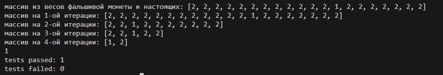

# Поиск фальшивой монеты

Проект реализует алгоритм для определения фальшивой монеты из заданного набора монет с использованием минимального количества взвешиваний.

## Описание

Все 3 алгоритма используют жадный подход для определения веса фальшивой монеты в наборе. Программа инициализирует массив монет, где все монеты, кроме одной, имеют одинаковый вес. Фальшивая монета имеет отличающийся вес, который задается пользователем. Программа рассчитывает положение и вес фальшивой монеты, а также отслеживает количество необходимых взвешиваний.

Сложность всех алгоритмов:
$$O(\log_{3}{n})$$
пример вывода coin_finder_a1.py

## Технологии

Программа написана на языке Python.

## Запуск проекта

1. Убедитесь, что у вас установлен Python версии 3.6 или выше.
2. Скачайте файлы проекта в локальную директорию.
3. Откройте терминал и перейдите в директорию с файлами проекта.

## Входные данные

Программа инициализируется массивом с настоящими монетами и поддельной

Эти значения могут быть изменены в коде перед запуском.

## Выходные данные

Программа выводит вес фальшивой монеты и общее количество проведенных взвешиваний.